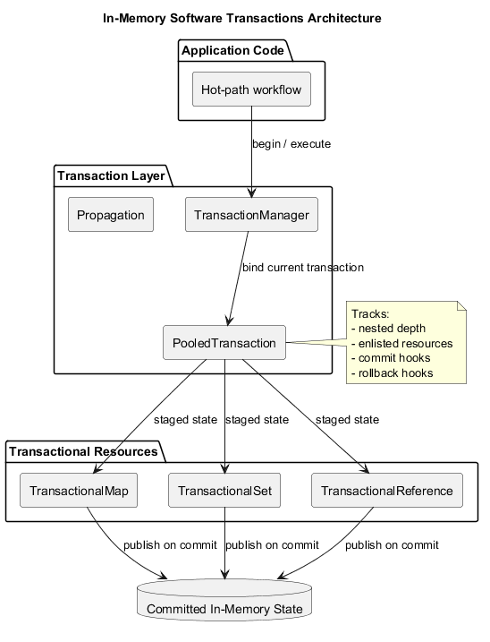
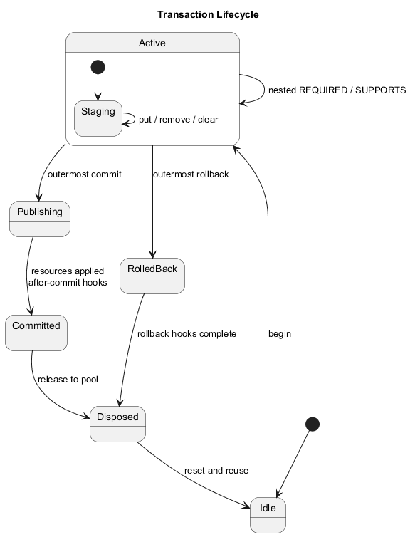
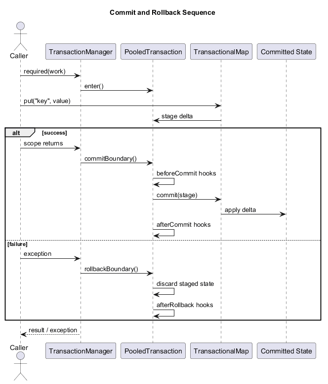

# in-memory-software-transactions

Lightweight in-memory transaction primitives for hot-path state mutation. The project shows how to stage changes against shared memory, apply them on commit, discard them on rollback, and keep transaction lifecycle overhead low enough to discuss seriously in systems interviews.

## Overview

This repository demonstrates a clean-room software transaction layer for in-memory state. It is useful when the state you care about lives in process memory, direct mutation is too risky, and bringing in a database transaction would either add latency or simply not solve the problem.

The framework centers on:

- thread-bound transaction contexts
- deferred mutation against transactional collections
- explicit commit and rollback hooks
- simple propagation semantics
- transaction instance reuse for allocation-sensitive paths

## Problem Statement

Many low-latency systems maintain authoritative or near-authoritative state in memory:

- request/session state caches
- active workflow state machines
- exposure, quota, or budget counters
- rule-engine working sets
- hot-path orchestration state before asynchronous persistence

Direct mutation is fast, but it is easy to end up with partially applied changes when validation fails midway through a workflow. Database transactions do not help if the critical state is local, transient, or intentionally kept off the storage path.

This project shows a pragmatic alternative:

1. Start a transaction.
2. Stage writes in transaction-local state.
3. Publish them only if the full workflow succeeds.
4. Discard them if the workflow fails.

## How It Works

### Transaction Begin

`TransactionManager` binds a pooled transaction object to the current thread. The transaction tracks enlisted resources, lifecycle depth, and registered callbacks.

### Local Mutation Tracking

Transactional resources such as `TransactionalMap`, `TransactionalSet`, and `TransactionalReference` keep committed state plus transaction-local staged state. Reads inside a transaction consult staged data first and fall back to committed data when needed.

### Commit Apply

On the outermost successful scope:

1. before-commit hooks run in registration order
2. enlisted resources publish staged state to committed state
3. after-commit hooks run in registration order

Nested `REQUIRED` scopes do not publish independently; they only increase lifecycle depth.

### Rollback Discard

Rollback never tries to reverse committed mutations. Instead, it drops staged state before publication and runs rollback hooks. This keeps rollback fast and predictable.

### Hook Execution

The framework supports:

- `beforeCommit(...)`
- `afterCommit(...)`
- `afterRollback(...)`

These hooks are useful for validation, metrics, or downstream event scheduling that should only happen when the in-memory mutation outcome is known.

### Transactional Collection Behavior

`TransactionalMap` uses staged delta state:

- puts live in a write map
- removals live in a removal set
- clear is tracked as a flag

Commit applies the delta to the shared map under a resource-local lock. `TransactionalSet` reuses the same semantics through a map-backed implementation. `TransactionalReference` provides the same behavior for single values.

### Propagation Semantics

- `REQUIRED`: join the current transaction or create a new one
- `REQUIRES_NEW`: suspend the current transaction and run a new one
- `SUPPORTS`: use the current transaction if present, otherwise run directly

This is enough to model the most common nested call behaviors without adding a full transaction manager stack or heavy framework integration.

## Architecture



The implementation is intentionally small:

- `io.github.memtx.tx`: transaction manager, pooled transaction, propagation, hook lifecycle
- `io.github.memtx.resource`: transactional map, set, and reference wrappers
- `io.github.memtx.demo`: runnable scenarios that make state visibility obvious

## Transaction Lifecycle



The lifecycle is depth-aware:

- enter outer scope
- stage resource state
- optionally enter nested `REQUIRED` scopes
- commit or rollback at inner boundaries without publishing yet
- publish or discard only when depth returns to zero

## Commit vs Rollback Flow



## Running the Demo

### Prerequisites

- JDK 8 or higher
- Maven 3.9 or higher

The project is intentionally written against Java 8 language and runtime constraints so it can be built on legacy JVM baselines as well as newer JDKs.

### Run Tests

```bash
mvn test
```

### Run the Demo

```bash
mvn -q exec:java "-Dexec.mainClass=io.github.memtx.demo.DemoApplication"
```

In PowerShell, keep the `-D...` argument quoted exactly as shown above. Without quotes, PowerShell can split the property name and Maven will report `Unknown lifecycle phase`.

## Example Behavior

Typical demo output looks like this:

```text
commit / inside tx       jobs=3, mode=COMMITTING
commit / committed       {jobs=3}, active=[jobs], mode=COMMITTING
commit / hooks           [before-commit, after-commit]
rollback / inside tx     jobs=99, mode=FAILED
rollback / committed     {jobs=3}, active=[jobs], mode=COMMITTING
rollback / hooks         [after-rollback]
propagation / committed  {jobs=3, inner=2}
pool / metrics           created=2, reused=4, pooled=2
```

What this demonstrates:

- staged writes are visible inside the transaction immediately
- rollback does not leak failed writes into committed state
- `REQUIRES_NEW` can commit independently from an outer rollback
- the manager can reuse transaction instances instead of allocating a fresh object every time

## Real-World Use Cases

- In-memory risk or exposure updates that must remain internally consistent before being flushed to storage or a stream.
- Pricing, cart, or session mutation that should either become visible atomically or not become visible at all.
- Rule-engine state transitions where validation may fail after several intermediate updates have been staged.
- Hot-path workflow mutation where local memory must stay coherent before asynchronous persistence catches up.
- Active feature or coordination state where nested operations need explicit isolation rules such as `REQUIRES_NEW`.

## Design Trade-offs

### Advantages

- Keeps the critical path in memory.
- Makes state visibility rules explicit.
- Avoids partial in-process mutation when validation fails.
- Stays much lighter than pulling in a full enterprise transaction stack.
- Demonstrates allocation-aware lifecycle management with object reuse.

### Limitations

- Transactions are thread-bound and single-process only.
- This is not a substitute for distributed consistency.
- Resource commit is only as safe as the resource implementation.
- Long-running transactions still increase contention around shared resources.
- The framework favors clarity and hot-path practicality over universal abstraction.

## Failure Scenarios

### A Transaction Fails Midway

If user code throws before the outermost commit boundary, staged state is discarded. Committed state remains unchanged.

### A Rollback Hook Fails

The staged mutation is still discarded. The framework throws `TransactionRollbackException` to report hook failure after rollback cleanup.

### Nested Transactions Interact

Nested `REQUIRED` scopes share one underlying transaction and only publish when the outermost scope commits. `REQUIRES_NEW` suspends the outer transaction and publishes independently.

### Transaction Reuse Is Enabled Incorrectly

Pooling is only safe when a transaction is fully reset before reuse. This repository includes reset behavior and tests that prove staged state and hook lists do not leak across runs.

### A Commit Hook or Resource Apply Fails

If a before-commit hook fails, the framework discards staged state and throws `TransactionCommitException`. If resource publication fails after commit has started, some resources may already have published changes; the exception makes that risk explicit rather than pretending rollback is still exact.

## Future Improvements

- Add transactional list or queue primitives.
- Add optional read-only transaction hints.
- Add benchmark modules for pooled vs non-pooled transaction lifecycles.
- Add configurable hook failure strategies for stricter production use.
- Add resource-level metrics and tracing integration.
